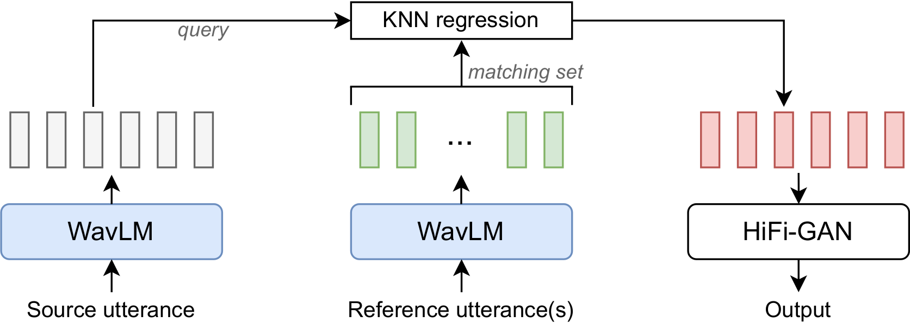

# Improving voice conversion with Extremal Neural Optimal Transport

This is a fork of [kNN-VC](https://github.com/bshall/knn-vc), which uses Extremal Neural Optimal Transport instead of Nearest Neighbors during sample matching in Voice Conversion.

Links:

- kNN-VC paper: [https://arxiv.org/abs/2305.18975](https://arxiv.org/abs/2305.18975)
- XNOT paper: [https://arxiv.org/abs/2301.12874](https://arxiv.org/abs/2301.12874)

Figure: kNN-VC setup. The source and reference utterance(s) are encoded into self-supervised features using WavLM. Each source feature is assigned to the mean of the k closest features from the reference. The resulting feature sequence is then vocoded with HiFi-GAN to arrive at the converted waveform output.

Figure: XNOT setup. By computing incomplete transport (IT) maps in high dimensions with neural networks, XNOT algorithm can partially align distributions or approximate extremal (ET) transport maps for unpaired domain translation tasks. 

## Quickstart

1. Clone [this](https://github.com/tardis-forever/xnot-vc) repo
2. **Install dependancies** from `requirements.txt`. It is advised that you have python version 3.10 or greater, and torch version v2.0 or greater.
3. Run reproducible experiments from [xnot_demo](./xnot_demo.ipynb) 

## Performance

The performance on the LibriSpeech dev-clean set is summarized:

| model | WER (%) &darr; | CER (%) &darr; |  EER (%) &uarr;  |
| ----- | :------------: | :------------: |:----------------:|
| [kNN-VC with prematched HiFiGAN](https://github.com/bshall/knn-vc/releases/download/v0.1/prematch_g_02500000.pt)* | 6.29 | 2.34 |      35.73       | 
| XNOT-VC with prematched HiFiGAN | ?? | ?? |        ??        | 

*As reported by original authors

## Training

During inference - voice conversion - an instance of `XNot` is trained (and returned) as an approximation of the best transport map between source and target audio features distribution.

## Acknowledgements

Parts of code for this project are adapted from the following repositories. Thank you to the authors of:

- HiFiGAN: https://github.com/jik876/hifi-gan
- WavLM: https://github.com/microsoft/unilm/tree/master/wavlm
- kNN-VC: https://github.com/bshall/knn-vc
- XNOT: https://github.com/milenagazdieva/ExtremalNeuralOptimalTransport
